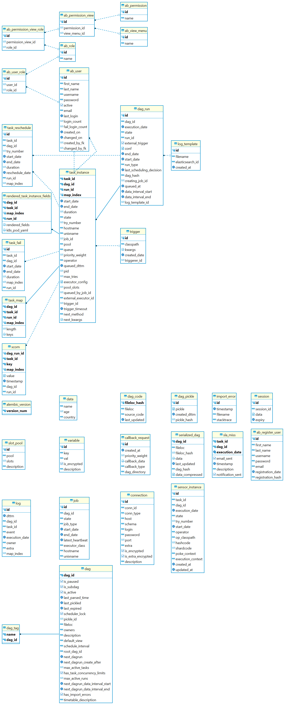

# Data Engineering
## Project description
* 
* 

## Architecture
The technical architecture for this project is as show below:

# Data model
* The data model for this project is as show below:

# Data Pipline
The ETL process runs through an Airlfow DAG:

The process is as follows:
1. 
2. 
3. 

# Team Members
* Zakariya Oulhadj
* Taylor Head
* Adam Zbikowski
* Samoil Bogdan Adascalului

# Team Roles
* [@ZOulhadj](https://github.com/ZOulhadj) - Product Owner
* [@Nero-DevOps](https://github.com/Nero-DevOps) - Scrum Master
* [@Adam](https://github.com/Frioo) - Team Leader 1
* [@archeris32](https://github.com/archeris32) - Team Leader 2