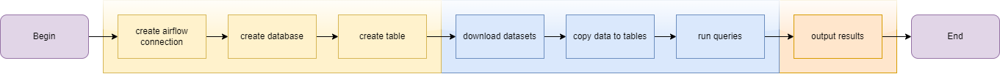

  

# Data Pipeline

# Team Members
* Zakariya Oulhadj
* Taylor Head
* Adam Zbikowski
* Samoil Bogdan Adascalului

# Team Roles
* [@ZOulhadj](https://github.com/ZOulhadj) - Product Owner
* [@Nero-DevOps](https://github.com/Nero-DevOps) - Scrum Master
* [@Adam](https://github.com/Frioo) - Team Leader 1
* [@archeris32](https://github.com/archeris32) - Team Leader 2

# Getting started 

The wiki can be accessed [here](https://github.com/Roe-Binary-Bandits/Data-Engineering/wiki)

